### Icons to use

https://icones.js.org/collection/all?s=logos

### Central Booking Engine Mermaid Diagram

```mermaid
architecture-beta
    group user(logos:aws)[User]
    service consumer(server)[Consumer] in user

    group waf(logos:aws-waf)[WAF]
    service akamai(logos:aws-waf)[Akamai] in waf

    group aws(logos:aws)[AWS]
    service api-gateway(logos:aws-api-gateway)[API Gateway] in aws
    service dynamodb(logos:aws-dynamodb)[DynamoDB] in aws
    group vpc(cloud)[VPC] in aws
    service lambda(logos:aws-lambda)[AWS Lambda] in vpc

    group external(external)[External Services]
    service booking-service-provider(server)[Booking Service Provider] in external

    consumer:R --> L:akamai
    akamai:R --> L:api-gateway
    api-gateway:R --> L:lambda
    lambda:B --> T:dynamodb
    lambda:R --> L:booking-service-provider
```

---

### Booking Application Mermaid Diagram

```mermaid
architecture-beta
    group user(logos:aws)[User]
    service consumer(logos:web)[Consumer] in user

    group waf(logos:aws-waf)[WAF]
    service akamai(logos:aws-waf)[Akamai] in waf

    group aws(logos:aws)[AWS]
    service cloudfront(logos:aws-cloudfront)[CloudFront] in aws

    service api-gateway(logos:aws-api-gateway)[API Gateway] in aws
    service s3(logos:aws-s3)[S3] in aws
    group vpc(cloud)[VPC] in aws
    service lambda(logos:aws-lambda)[AWS Lambda] in vpc

    group central-booking(external)[Central BookingAPI]
    service booking-services(server)[Booking Service Provider] in central-booking

    consumer:R --> L:akamai
    akamai:R --> L:api-gateway
    api-gateway:R --> L:lambda
    akamai:R --> L:cloudfront
    cloudfront:R --> L:s3
    lambda:R --> L:booking-services
```

---

### Manage Application Mermaid Diagram

---

### Check-in Application Mermaid Diagram

